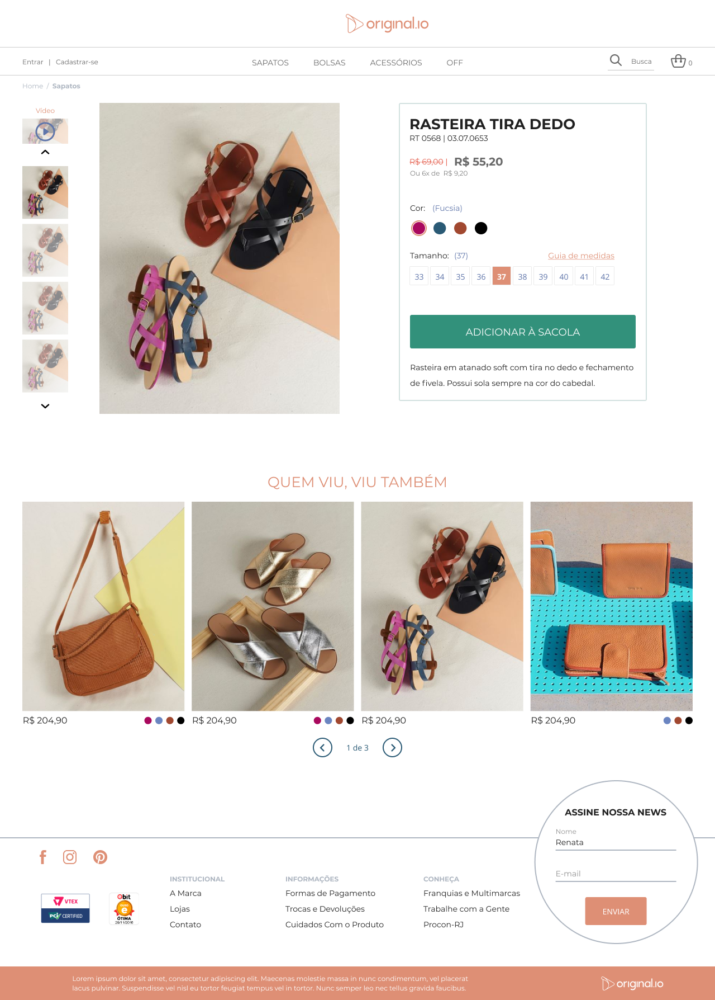

<h1 align="center">
    
</h1>

<h4 align="center">
  Project developed to learn about react, stripe and nextjs!
</h4>

## :rocket: Technology

This project was developed with the following technologies:

- [Typescript](https://www.typescriptlang.org/)
- [Stripe Integration](https://stripe.com/br)
- [Styled Components](https://styled-components.com/)
- [Styled Media Query](https://github.com/morajabi/styled-media-query)
- [Netlify](https://www.netlify.com/)

## 💻 Project

The layout of this project refers to an e-commerce, carried out with the aim of testing knowledge in react js and its attributes.

[Layout and preferences based on join us of Original](https://github.com/original-io/join-us)

## How to Using

- [Access](https://originalio-nextjs.netlify.app/)
- Card for Testing
  - https://stripe.com/docs/testing

## License

[MIT License](./LICENSE)

---

<h4 align="center">
  Code made :heart: by <a href="https://www.linkedin.com/in/jonathanccardoso/" target="_blank">Jonathan Cardoso</a>
</h4>
